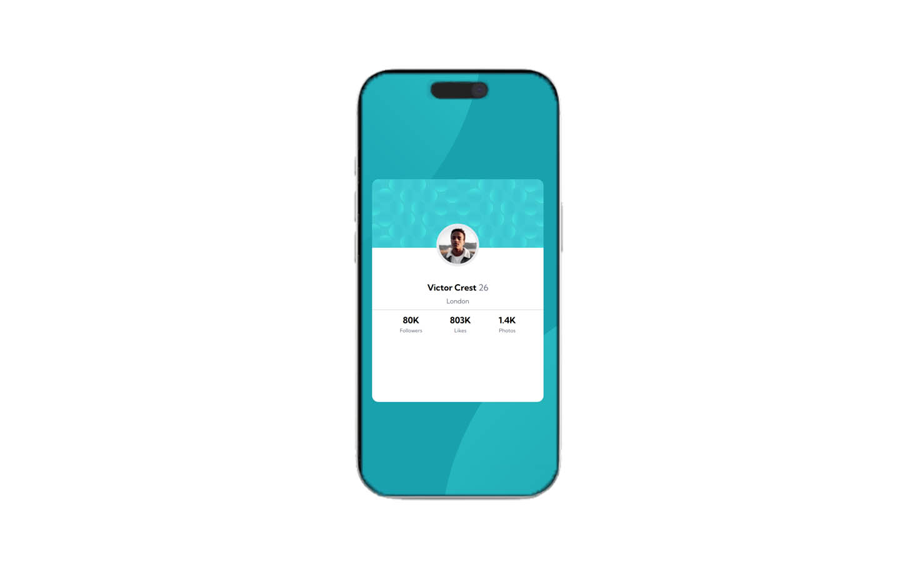

# Frontend Mentor - Profile card component

This is a solution to the [Profile card component](https://www.frontendmentor.io/challenges/profile-card-component-cfArpWshJ).

## Table of contents

- [Overview](#overview)
  - [The challenge](#the-challenge)
  - [Screenshot](#screenshot)
  - [Links](#links)
- [My process](#my-process)
  - [Built with](#built-with)
  - [What I learned](#what-i-learned)
  - [Continued development](#continued-development)
  - [Useful resources](#useful-resources)
- [Author](#author)
- [Acknowledgments](#acknowledgments)

## Overview

### The challenge

Build a responsive profile card component using semantic HTML and clean CSS that matches a given design (likely from Frontend Mentor).

### Screenshot

### Links

- Solution URL: https://github.com/sazzadkhan99/profile-card-component
- Live Site URL: https://sazzadkhan99.github.io/profile-card-component

## My process

Structured HTML with CSS and responsive design with media queries

### Built with

--HTML5
--CSS3
--CSS Variables
--Responsive Design (Media Queries)

### What I learned

--Proper use of semantic tags and typography
--Creating a consistent, clean layout with reusable variables
--Handling responsive design for smaller screens

### Continued development

Use this section to outline areas that you want to continue focusing on in future projects. These could be concepts you're still not completely comfortable with or techniques you found useful that you want to refine and perfect.

### Useful resources

- [Example resource 1](https://www.example.com) - This helped me for XYZ reason. I really liked this pattern and will use it going forward.
- [Example resource 2](https://www.example.com) - This is an amazing article which helped me finally understand XYZ. I'd recommend it to anyone still learning this concept.

## Author

- Website - [Add your name here](https://www.your-site.com)
- Frontend Mentor - [@sazzadkhan99](https://www.frontendmentor.io/profile/sazzadkhan99)
- Twitter - [@yourusername](https://www.twitter.com/yourusername)

## Acknowledgments

Challenge idea and design inspired by Frontend Mentor – helped improve layout, semantic HTML, and CSS structuring skills.

